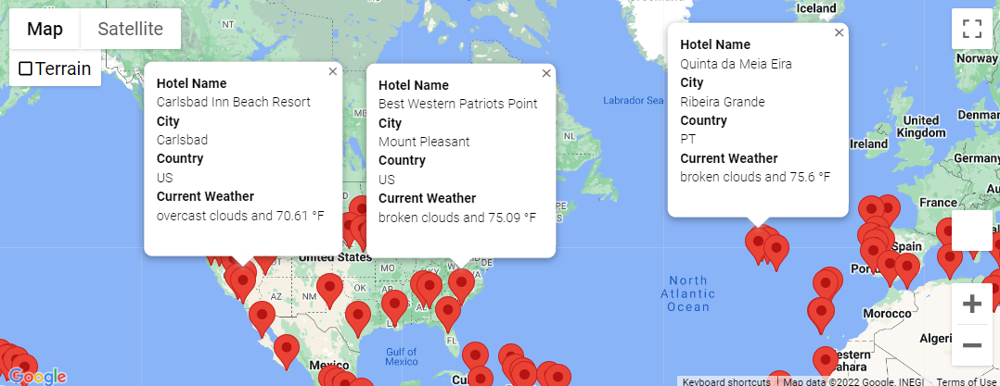
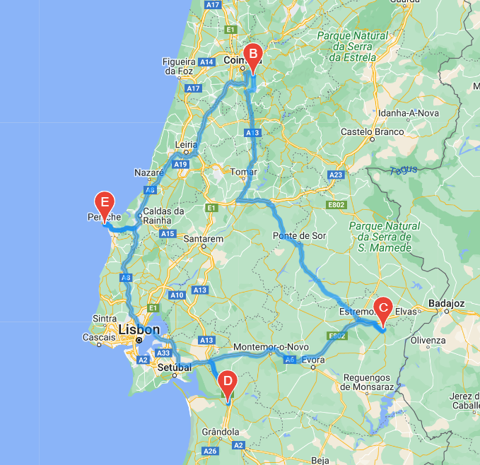

# World Weather Analysis

## Overview of Project
We were tasked to assist Jack, the head of analysis for the UI team, by collecting and presenting data for customers via the search page. Customers will filter based on their preferred travel criteria, such as weather, in order to find their ideal hotel anywhere in the world.

Based on our assignment, we completed the following technical analyses:
1. Retrieved weather data
2. Created a customer travel desinations map
3. Created a travel itinerary map
 
 
## Process & Results 

By generating our sample data of 2,000 coordinates, we fixated on over 700 cities around the world. Utilizing the OpenWeatherMap API, we retrieved the latitude, longitude, max temperature, humidity percentage, cloudiness percentage, wind speed, and weather description of all cities.

With the information obtained of all cities in our sample data, we identified nearby hotels using the Google Nearby Search API, adding the hotel names to our dataframe.

Lastly, our Beta tester selected 4 cities in one particular country to create an itinerary map for. Our selected cities resided in Portugal. The cities chosen were Peniche (our start and end point), Lata, Villa Vicosa, and Alcacer Do Sal. Using the Gmaps Directions Layer, a route was mapped out from our start point to our end point, connecting to all cities along the way.

 
 
## Summary & Conclusion
Utilizing APIs, we created an interface for customers to input their desired minimum and maximum destination temperature. From the results, they can select hotels from various cities to book for their next vacation.
